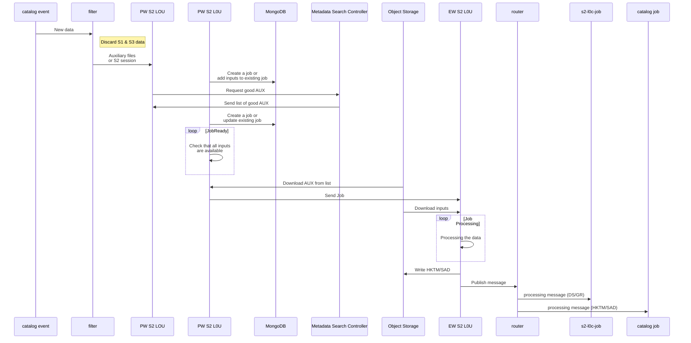

```mermaid
sequenceDiagram
    catalog event->>filter: New data
    Note right of filter: Discard S1 & S3 data
    filter->>PW S2 LOU: Auxiliary files <br/>or S2 session
    PW S2 L0U->>MongoDB: Create a job or <br/>add inputs to existing job
    PW S2 LOU->>Metadata Search Controller: Request good AUX
    Metadata Search Controller->>PW S2 LOU: Send list of good AUX
    PW S2 L0U->>MongoDB: Create a job or <br/>update existing job
    loop JobReady
        PW S2 L0U->>PW S2 L0U: Check that all inputs <br/>are available
    end
    Object Storage->>PW S2 L0U: Download AUX from list
    PW S2 L0U->>EW S2 L0U: Send Job
    Object Storage->>EW S2 L0U: Download inputs
    loop Job Processing
        EW S2 L0U->>EW S2 L0U: Processing the data
    end
    EW S2 L0U->>Object Storage: Write HKTM/SAD
    EW S2 L0U->>router: Publish message
    router->>s2-l0c-job: processing message (DS/GR)
    router->>catalog job: processing message (HKTM/SAD)
```
